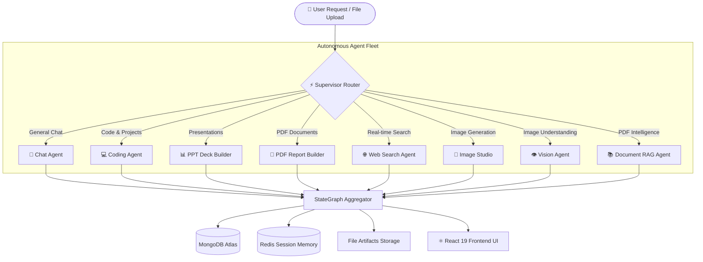

# 🧠 CortexFlow AI

### *Autonomous Multi-Agent Intelligence Platform*

---

[](https://fastapi.tiangolo.com/)
[](https://langchain-ai.github.io/langgraph/)
[](https://react.dev/)
[](https://tailwindcss.com/)
[](https://www.docker.com/)

---

## 📌 Executive Overview

**CortexFlow AI** is a full-stack, enterprise-grade multi-agent artificial intelligence platform. Powered by **LangGraph StateGraph** and **FastAPI**, it orchestrates specialized autonomous agents to deliver sub-second reasoning, full-stack code synthesis, document intelligence (RAG), presentation generation, formal reporting, real-time web search, and computer vision.

---

## 🚀 Key Highlights

- **⚡ Sub-Second Inference**: Powered by Groq LPUs (`openai/gpt-oss-120b`, `qwen/qwen3.6-27b`) delivering ~1.5s average response times.
- **🛡️ 3-Tier Zero-Downtime Failover**: Seamless automatic failover across **Groq $\to$ Google Gemini $\to$ OpenAI**.
- **💻 Interactive Code Sandbox**: Scaffolds multi-file projects (HTML/CSS/JS/Python) with a live Monaco Code Editor in the browser.
- **📊 Real Document Generation**: Directly compiles and exports native `.pptx` slide decks and `.pdf` executive reports.
- **📚 Qdrant Vector RAG**: Semantic document chunking, embeddings, and similarity search over uploaded PDF files.
- **🌐 0ms Heuristic Fast-Routing**: Regex-based intent classification eliminates redundant LLM hops for instant response dispatch.

---

## 🤖 Specialized AI Agents Matrix

| Icon | Agent Name                      | Primary Responsibility                         | Output / Tooling                                |
| :--: | :------------------------------ | :--------------------------------------------- | :---------------------------------------------- |
|  ⚡  | **Supervisor Router**     | Intent analysis & dynamic node routing         | LangGraph Router Node (0ms Heuristic)           |
|  💬  | **Conversational**        | Complex reasoning, math, and dialogue          | Groq LPU / Gemini Flash                         |
|  💻  | **Coding & Architecture** | Web apps, scripts, and code reviews            | Multi-File Artifacts & Monaco Editor            |
|  📊  | **PPT Builder**           | 8-Slide presentations with custom layouts      | `python-pptx` $\to$ `.pptx` File Download |
|  📄  | **PDF Report Engine**     | Professional documents, whitepapers, summaries | ReportLab Flowables$\to$ `.pdf` Download    |
|  🌐  | **Web Intelligence**      | Real-time facts, news, and live search         | Tavily API & DuckDuckGo                         |
|  🎨  | **AI Image Studio**       | Cinematic prompt enhancer & image synthesis    | Pollinations Fast Streaming CDN                 |
| 👁️ | **Multimodal Vision**     | Visual QA, diagram analysis, chart reading     | Multimodal Base64 Vision Models                 |
|  📚  | **Document RAG**          | In-depth QA grounded in uploaded documents     | Qdrant Vector Store & PyPDF                     |

---

## 🏛️ System Architecture



---

## 📁 Repository Structure

```text
CortexFlow_AI/
├── docker-compose.yml              # 4-Container Orchestration (Backend, Mongo, Redis, Qdrant)
├── render.yaml                     # Render Cloud 1-Click Deployment Blueprint
├── README.md                       # Documentation
│
├── backend/                        # 🐍 Python FastAPI + LangGraph Backend
│   ├── app/
│   │   ├── api/                    # REST Endpoints (auth, chat, agent, billing)
│   │   ├── agents/                 # LangGraph Multi-Agent Engine
│   │   │   ├── nodes/              # 8 Specialized Agent Nodes
│   │   │   ├── tools/              # Qdrant RAG & Web Search Tools
│   │   │   ├── llm.py              # 3-Tier Multi-Provider Failover Pipeline
│   │   │   ├── state.py            # AgentState TypedDict
│   │   │   └── supervisor.py       # Compiled StateGraph
│   │   ├── core/                   # Config, Database, Redis, Security, Storage
│   │   ├── schemas/                # Pydantic Request & Response Models
│   │   └── main.py                 # FastAPI Application Entrypoint
│   ├── requirements.txt            # Python Dependencies
│   ├── Dockerfile                  # Production Container Definition
│   └── .env                        # Backend Environment Variables
│
└── frontend/                       # ⚛️ React 19 + Vite + Tailwind CSS Frontend
    ├── src/
    │   ├── components/             # ChatArea, Monaco ArtifactPanel, Sidebar, Modals
    │   ├── features/               # Axios API Client Slices
    │   ├── hooks/                  # Custom Authentication Hooks
    │   ├── redux/                  # Redux Toolkit State Management
    │   └── pages/                  # Main Application Views
    ├── package.json                # Frontend Dependencies
    └── vite.config.js              # Vite Build Configuration
```

---

## 🛠️ Tech Stack & Dependencies

```
Backend:      Python 3.11  •  FastAPI  •  LangGraph  •  LangChain  •  Uvicorn  •  Pydantic v2
Frontend:     React 19     •  Vite     •  Tailwind CSS v4  •  Redux Toolkit  •  Monaco Editor
Databases:    MongoDB (Motor Async)  •  Redis (Asyncio Cache)  •  Qdrant Vector Database
AI / LLMs:    Groq LPU (Llama 3.3, GPT-OSS)  •  Google Gemini 2.5/3.6  •  OpenAI GPT-4o
Documents:    python-pptx  •  ReportLab  •  PyPDF  •  Pillow  •  HTTPX
DevOps:       Docker  •  Docker Compose  •  Render Cloud Platform
```

---

## ⚡ Quickstart Guide

### Prerequisites

- **Python**: 3.11 or higher
- **Node.js**: 18.0 or higher
- **Docker Desktop**: *(Optional, for containerized run)*

---

### Step 1: Clone Repository & Setup Environment

```bash
git clone https://github.com/Abhi956967/CortexFlow_AI.git
cd CortexFlow_AI
```

Create a `.env` file inside the `backend/` directory:

```env
# Server
PORT=8000
SECRET_KEY=cortexflow_super_secret_jwt_key_2026
ACCESS_TOKEN_EXPIRE_MINUTES=10080

# Databases
MONGODB_URI="mongodb+srv://<user>:<password>@cluster0.xxxxx.mongodb.net/cortexflow_ai?retryWrites=true&w=majority"
DATABASE_NAME=cortexflow_ai
REDIS_URL=redis://localhost:6379
QDRANT_URL=http://localhost:6333

# AI Provider API Keys (At least one required)
GROQ_API_KEY=gsk_xxxxxxxxxxxxxxxxxxxxxxxxxxxx
GOOGLE_API_KEY=AIzaSyxxxxxxxxxxxxxxxxxxxxxxx
OPENAI_API_KEY=sk-proj-xxxxxxxxxxxxxxxxxxxxxx
TAVILY_API_KEY=tvly-xxxxxxxxxxxxxxxxxxxxxxxxx

# Storage
STORAGE_TYPE=local
UPLOAD_DIR=storage_uploads
STATIC_URL=http://localhost:8000/storage
```

---

### Step 2: Run Application

#### Option A: Native Local Run (Recommended for Dev)

**1. Start Backend (Terminal 1):**

```powershell
cd backend
python -m venv venv
.\venv\Scripts\activate       # Windows PowerShell
# source venv/bin/activate    # Linux / macOS

pip install -r requirements.txt
uvicorn app.main:app --reload --port 8000
```

> 📍 **Backend**: `http://127.0.0.1:8000` | **Swagger API Docs**: `http://127.0.0.1:8000/docs`

**2. Start Frontend (Terminal 2):**

```powershell
cd frontend
npm install
npm run dev
```

> 📍 **Frontend**: `http://localhost:5173`

---

#### Option B: 1-Click Docker Compose (Production Stack)

```bash
docker-compose up --build -d
```

Starts all 4 isolated services:

- `cortexflow_backend` $\to$ `http://localhost:8000`
- `cortexflow_mongodb` $\to$ `localhost:27017`
- `cortexflow_redis` $\to$ `localhost:6379`
- `cortexflow_qdrant` $\to$ `localhost:6333`

---

## 🌐 Cloud Deployment (Render Blueprint)

1. **Push Code to GitHub**:
   ```bash
   git add .
   git commit -m "Deploy CortexFlow AI"
   git push origin main
   ```
2. **Deploy on [Render.com](https://render.com)**:
   - **Backend Web Service**:
     - Root: `backend` | Build: `pip install -r requirements.txt` | Start: `uvicorn app.main:app --host 0.0.0.0 --port $PORT`
     - Env Vars: Add `GROQ_API_KEY`, `GOOGLE_API_KEY`, `MONGODB_URI`.
   - **Frontend Static Site**:
     - Root: `frontend` | Build: `npm run build` | Publish: `dist`
     - Rewrite Rule: `/*` $\to$ `/index.html` (Action: `Rewrite`).
     - Env Var: `VITE_SERVER_URL=https://<your-backend-service>.onrender.com`.

---

## 📡 API Reference Summary

| Method   | Route                             | Description                                      |
| :------- | :-------------------------------- | :----------------------------------------------- |
| `POST` | `/api/agent/chat`               | Main Multi-Agent Execution Endpoint              |
| `POST` | `/api/auth/register`            | Register new user & issue JWT                    |
| `POST` | `/api/auth/login`               | Authenticate user credentials                    |
| `GET`  | `/api/auth/me`                  | Fetch authenticated user profile & balance       |
| `GET`  | `/api/chat/get-conversations`   | Retrieve list of user conversations              |
| `POST` | `/api/chat/create-conversation` | Initialize a new conversation thread             |
| `GET`  | `/api/chat/get-messages/{id}`   | Fetch conversation message history               |
| `GET`  | `/storage/{filename}`           | Download generated artifacts (.pptx, .pdf, .png) |
| `GET`  | `/health`                       | Health check & microservice status               |

---

## 📄 License

Distributed under the **MIT License**. See `LICENSE` for more details.

---

<div align="center">
  <b>Built by Abhishek Maurya & the CortexFlow AI Team</b>
</div>
