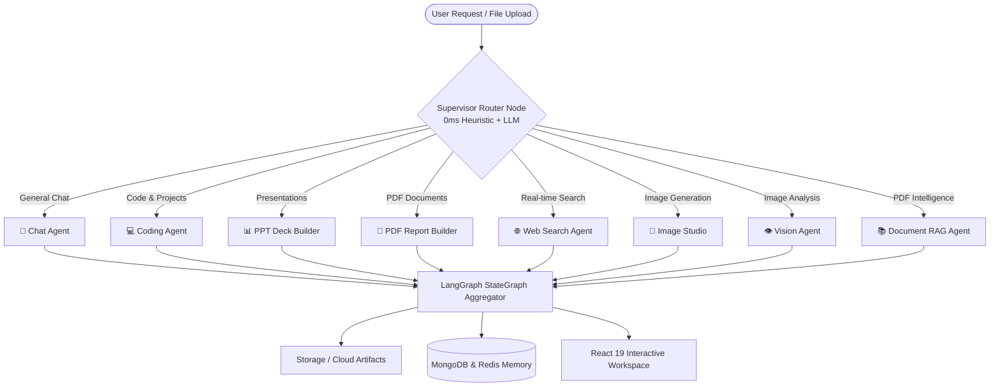

# 🧠 CortexFlow AI — Autonomous Multi-Agent Intelligence Platform

<div align="center">

---

## 📑 Table of Contents

- [✨ Key Features](#-key-features)
- [🤖 The 8 Specialized AI Agents](#-the-8-specialized-ai-agents)
- [🏛 Architecture &amp; Workflow](#-architecture--workflow)
- [📁 Project Structure](#-project-structure)
- [🛠 Tech Stack](#-tech-stack)
- [🚀 Getting Started (Step-by-Step)](#-getting-started-step-by-step)
  - [Prerequisites](#prerequisites)
  - [1. Clone Repository &amp; Setup `.env`](#1-clone-repository--setup-env)
  - [2. Option A: Run Locally (Native Python + Node)](#2-option-a-run-locally-native-python--node)
  - [3. Option B: Run with Docker Compose (1-Click)](#3-option-b-run-with-docker-compose-1-click)
- [🌐 Cloud Deployment (Render Guide)](#-cloud-deployment-render-guide)
- [📡 API Documentation](#-api-documentation)
- [🛡️ Failover &amp; Performance Optimizations](#️-failover--performance-optimizations)
- [🤝 Contributing &amp; License](#-contributing--license)

---

## ✨ Key Features

- **Multi-Agent Orchestration**: Powered by **LangGraph StateGraph**, tasks are routed dynamically to dedicated, expert agent nodes.
- **Ultra-Fast Inference (Groq LPUs)**: Sub-second (~1.5s) responses using Llama 3.3 and GPT-OSS models on Groq.
- **Zero-Downtime Multi-Provider Fallback**: Instant automatic failover across Groq $\to$ Google Gemini $\to$ OpenAI on rate limits (429) or spikes.
- **Interactive Coding Sandbox & Artifacts**: Live multi-file project scaffolding (HTML/CSS/JS) rendered in a browser Monaco Code Editor.
- **Document & Presentation Generators**: Generates real `.pptx` presentations and `.pdf` documents with direct download links.
- **Document Intelligence (RAG)**: Chunking, embedding, and vector search over uploaded PDF files with Qdrant Vector DB.
- **Zero-Setup In-Memory Mode**: Built-in in-memory fallback stores for MongoDB & Redis for zero-friction local development.
- **Modern React 19 Frontend**: Dark cyberpunk theme, Redux state management, Lucide icons, and real-time streaming UI.

---

## 🤖 The 8 Specialized AI Agents

| Agent Icon | Agent Name                     | Primary Function                                           | Core Technology                         |
| :--------: | :----------------------------- | :--------------------------------------------------------- | :-------------------------------------- |
|     ⚡     | **Supervisor & Router**  | 0ms Heuristic Intent Analysis & Dynamic Node Dispatcher    | Regex Heuristics + LangGraph Supervisor |
|     💬     | **Conversational Agent** | Deep contextual reasoning, brainstorming, and explanations | Groq LPU / Gemini Flash                 |
|     💻     | **Coding Agent**         | Full-stack web code generation & code review artifacts     | Monaco Editor, Project Artifacts        |
|     📊     | **PPT Agent**            | 8-Slide PowerPoint Deck Builder with custom styling        | `python-pptx`, Slide Layout Engine    |
|     📄     | **PDF Agent**            | Formatted executive reports, invoices, and summaries       | ReportLab Flowables Engine              |
|     🌐     | **Web Search Agent**     | Live factual search, sports scores, news, and weather      | Tavily API & DuckDuckGo Search          |
|     🎨     | **AI Image Studio**      | Cinematic prompt enhancer & high-res image generator       | Pollinations Fast Streaming CDN         |
|    👁️    | **Vision Agent**         | Multimodal image understanding and diagram analysis        | Base64 Multimodal Vision LLMs           |
|     📚     | **Document RAG**         | PDF document chunking and semantic similarity search       | Qdrant Vector DB, PyPDF, Embeddings     |

---

## 🏛 Architecture & Workflow



---

## 📁 Project Structure

```text
CortexFlow_AI/
├── docker-compose.yml              # 4-Container Orchestration (FastAPI, Mongo, Redis, Qdrant)
├── render.yaml                     # Render Cloud 1-Click Deployment Blueprint
├── backend/
│   ├── app/
│   │   ├── core/                   # Security, DB connections, Redis, and Storage
│   │   │   ├── config.py           # Pydantic Settings & Environment loader
│   │   │   ├── database.py         # Async Motor MongoDB connection + In-Memory Fallback
│   │   │   ├── redis_client.py     # Redis Async helper + In-Memory Session Store
│   │   │   ├── security.py         # JWT Token creation & native Bcrypt hashing
│   │   │   └── storage.py          # Storage for generated artifacts (PPT, PDF, Images)
│   │   │
│   │   ├── schemas/                # Pydantic Models for Data Validation
│   │   │   ├── auth.py             # User register & login schemas
│   │   │   ├── chat.py             # Conversation & message schemas
│   │   │   ├── agent.py            # Agent requests & responses
│   │   │   └── billing.py          # Plans & Payments
│   │   │
│   │   ├── api/                    # REST & Streaming Endpoints
│   │   │   ├── auth.py             # /api/auth (Register, Login, Me)
│   │   │   ├── chat.py             # /api/chat (Conversations, Messages CRUD)
│   │   │   ├── agent.py            # /api/agent/chat (Multi-Agent Engine)
│   │   │   └── billing.py          # /api/billing (Pricing & Razorpay)
│   │   │
│   │   ├── agents/                 # LangGraph Multi-Agent Engine
│   │   │   ├── state.py            # AgentState TypedDict
│   │   │   ├── llm.py              # Multi-Provider Failover LLM Pipeline
│   │   │   ├── supervisor.py       # Compiled StateGraph & Supervisor
│   │   │   ├── nodes/              # Individual Agent Nodes
│   │   │   │   ├── router_node.py  # 0ms Heuristic & LLM Intent Router
│   │   │   │   ├── chat_node.py    # Conversational Agent
│   │   │   │   ├── coding_node.py  # Coding & Artifact Generator
│   │   │   │   ├── search_node.py  # Real-Time Search Agent
│   │   │   │   ├── pdf_gen_node.py # PDF Report Generator
│   │   │   │   ├── ppt_node.py     # PowerPoint Deck Generator
│   │   │   │   ├── image_node.py   # AI Image Studio
│   │   │   │   ├── vision_node.py  # Multimodal Vision Analysis
│   │   │   │   └── rag_node.py     # Document RAG with Qdrant
│   │   │   └── tools/              # Specialized Agent Tooling
│   │   │       ├── web_search.py   # Search APIs
│   │   │       └── qdrant_rag.py   # Qdrant Indexer & Retriever
│   │   │
│   │   └── main.py                 # FastAPI Application + CORS + Swagger docs
│   │
│   ├── venv/                       # Python Virtual Environment
│   ├── requirements.txt            # Python Dependencies
│   ├── Dockerfile                  # Production Dockerfile
│   └── .env                        # Configured environment variables
│
└── frontend/                       # React 19 + Vite + Tailwind + Redux
    ├── src/
    │   ├── components/             # ChatArea, Monaco ArtifactPanel, Sidebar, etc.
    │   ├── features/               # API Clients (Axios endpoints)
    │   ├── hooks/                  # Custom React Hooks (useCurrentUser)
    │   ├── redux/                  # Redux Toolkit Slices & Store
    │   ├── pages/                  # Home Page & Auth Modals
    │   └── utils/                  # Axios dynamic base URL configuration
    ├── package.json                # Frontend Dependencies
    └── vite.config.js              # Vite Build Configuration
```

---

## 🛠 Tech Stack

- **Backend**: Python 3.11, FastAPI, Uvicorn, LangGraph, LangChain, Pydantic v2.
- **Frontend**: React 19, Vite, Tailwind CSS v4, Redux Toolkit, Monaco Editor (`@monaco-editor/react`), Lucide Icons.
- **AI & LLMs**: Groq LPUs (`openai/gpt-oss-120b`, `qwen/qwen3.6-27b`), Google Gemini (`gemini-flash-latest`), OpenAI (`gpt-4o-mini`).
- **Databases**: MongoDB (Motor Async Driver), Redis (Asyncio Cache), Qdrant Vector DB.
- **Document & Media Libraries**: `python-pptx`, `reportlab`, `pypdf`, `Pillow`, `httpx`.
- **DevOps**: Docker, Docker Compose, Render Blueprint (`render.yaml`).

---

## 🚀 Getting Started (Step-by-Step)

### Prerequisites

- [Python 3.11+](https://www.python.org/downloads/)
- [Node.js 18+](https://nodejs.org/) & `npm`
- [Docker Desktop](https://www.docker.com/products/docker-desktop/) *(Optional, for containerized run)*

---

### 1. Clone Repository & Setup `.env`

```bash
git clone https://github.com/Abhi956967/CortexFlow_AI.git
cd CortexFlow_AI
```

Create a `.env` file in the **`backend/`** directory (and root directory):

```env
# Server
PORT=8000
SECRET_KEY=cortexflow_super_secret_jwt_key_2026
ACCESS_TOKEN_EXPIRE_MINUTES=10080

# Databases (Uses Cloud Atlas or Local/In-Memory fallback)
MONGODB_URI="mongodb+srv://<username>:<password>@cluster0.xxxxx.mongodb.net/cortexflow_ai?retryWrites=true&w=majority"
DATABASE_NAME=cortexflow_ai
REDIS_URL=redis://localhost:6379
QDRANT_URL=http://localhost:6333

# AI API Keys (Provide at least one)
GROQ_API_KEY=gsk_xxxxxxxxxxxxxxxxxxxxxxxxxxxxxxxx
GOOGLE_API_KEY=AIzaSyxxxxxxxxxxxxxxxxxxxxxxxxxxxxx
OPENAI_API_KEY=sk-proj-xxxxxxxxxxxxxxxxxxxxxxxxxxx
TAVILY_API_KEY=tvly-xxxxxxxxxxxxxxxxxxxxxxxxxxxxxx

# Storage
STORAGE_TYPE=local
UPLOAD_DIR=storage_uploads
STATIC_URL=http://localhost:8000/storage
```

---

### 2. Option A: Run Locally (Native Python + Node)

#### 🟢 Step 1: Start Backend (Terminal 1)

```powershell
# Navigate to backend
cd backend

# Create and activate virtual environment
python -m venv venv
.\venv\Scripts\activate       # On Windows PowerShell
# source venv/bin/activate    # On Linux / macOS

# Install dependencies
pip install -r requirements.txt

# Start FastAPI server
uvicorn app.main:app --reload --port 8000
```

> **Backend URL**: `http://127.0.0.1:8000` | **Interactive Swagger Docs**: `http://127.0.0.1:8000/docs`

#### 🔵 Step 2: Start Frontend (Terminal 2)

```powershell
# Open a new terminal and navigate to frontend
cd frontend

# Install Node dependencies
npm install

# Start Vite dev server
npm run dev
```

> **Frontend URL**: `http://localhost:5173`

---

### 3. Option B: Run with Docker Compose (1-Click)

Ensure Docker Desktop is running, then execute from the root directory:

```bash
docker-compose up --build -d
```

This starts all **4 containers** in the background:

- 🚀 `cortexflow_backend` on `http://localhost:8000`
- 🍃 `cortexflow_mongodb` on `localhost:27017`
- ⚡ `cortexflow_redis` on `localhost:6379`
- 🔍 `cortexflow_qdrant` on `localhost:6333`

To stop all containers:

```bash
docker-compose down
```

---

## 🌐 Cloud Deployment (Render Guide)

This repository includes a native `render.yaml` Blueprint for **1-click cloud deployment** on [Render.com](https://render.com).

### Deployment Architecture on Render:

- **Backend**: Render Web Service (Python 3) $\to$ `https://cortexflow-backend.onrender.com`
- **Frontend**: Render Static Site (Vite React 19) $\to$ `https://cortexflow-frontend.onrender.com`
- **Database**: Free Managed Cluster on [MongoDB Atlas](https://www.mongodb.com/cloud/atlas)

### Render Configuration Steps:

1. **Backend Web Service**:
   - **Root Directory**: `backend`
   - **Build Command**: `pip install -r requirements.txt`
   - **Start Command**: `uvicorn app.main:app --host 0.0.0.0 --port $PORT`
   - **Environment Variables**: Add your `GROQ_API_KEY`, `GOOGLE_API_KEY`, and `MONGODB_URI`.
2. **Frontend Static Site**:
   - **Root Directory**: `frontend`
   - **Build Command**: `npm run build`
   - **Publish Directory**: `dist`
   - **Redirects/Rewrites**: Set Source `/*` $\to$ Destination `/index.html` (Action: `Rewrite`).
   - **Environment Variables**: `VITE_SERVER_URL=https://cortexflow-backend.onrender.com`.

---

## 📡 API Documentation

Interactive OpenAPI / Swagger documentation is available at `/docs`:

| Method   | Endpoint                          | Description                                      |
| :------- | :-------------------------------- | :----------------------------------------------- |
| `POST` | `/api/agent/chat`               | Main Multi-Agent Execution Endpoint (LangGraph)  |
| `POST` | `/api/auth/register`            | Register new user with JWT token                 |
| `POST` | `/api/auth/login`               | Login user and issue access token                |
| `GET`  | `/api/auth/me`                  | Fetch authenticated user profile & credits       |
| `GET`  | `/api/chat/get-conversations`   | Retrieve user chat conversation history          |
| `POST` | `/api/chat/create-conversation` | Initialize a new chat thread                     |
| `GET`  | `/api/chat/get-messages/{id}`   | Get all messages & artifacts for a thread        |
| `GET`  | `/storage/{filename}`           | Download generated artifacts (PPTX, PDF, Images) |
| `GET`  | `/health`                       | System health check & multi-agent status         |

---

## 🛡️ Failover & Performance Optimizations

```text
User Request
    │
    ▼
[0ms Heuristic Intent Match]  ──(Explicit keyword match)──► Skip Router LLM (0ms Latency)
    │ (Ambiguous query)
    ▼
[LangGraph Router Node]
    │
    ▼
[Primary Model: Groq LPU] ─────(Success in ~1.5s)─────────► Return Response
    │ (429 Rate Limit / Spike)
    ▼
[Fallback 1: Gemini Flash] ────(Instant 0-Retry Switch)──► Return Response
    │ (If Unavailable)
    ▼
[Fallback 2: OpenAI GPT-4o-mini] ────────────────────────► Return Response
```

---

## 🤝 Contributing & License

Contributions, issues, and feature requests are welcome!

1. Fork the Project
2. Create your Feature Branch (`git checkout -b feature/AmazingFeature`)
3. Commit your Changes (`git commit -m 'Add some AmazingFeature'`)
4. Push to the Branch (`git push origin feature/AmazingFeature`)
5. Open a Pull Request

Distributed under the **MIT License**. See `LICENSE` for more information.

---

<div align="center">
  <b>Built with ❤️ by Arun Kumar & the CortexFlow AI Team</b>
</div>
